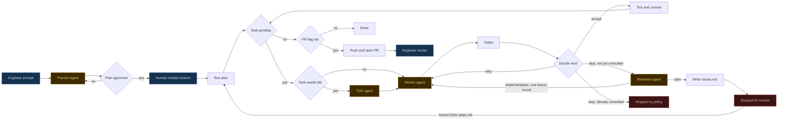

# Pipeline flow

What the loop actually does. Kept deliberately plain so it is easy to edit —
see **Editing rules** below before proposing a change.

Blue is the human, orange is a model call, red is an exit. Everything
unstyled is deterministic code.

## Where each box lives

| Box                  | Code                              | Notes                                                                                                                                                             |
| -------------------- | --------------------------------- | ----------------------------------------------------------------------------------------------------------------------------------------------------------------- |
| Planner agent        | `.claude/skills/planner/SKILL.md` | Invokes `grilling` first; two gates of its own                                                                                                                    |
| Plan approved        | `plan.mjs:68`                     | `approved` is just `steps.md` being non-empty — the planner's Gate 2                                                                                              |
| Human creates branch | `git.mjs:16-25`                   | `assertBranch` refuses `main`/`master`; branch creation is deliberately manual                                                                                    |
| Run plan             | `cli.mjs:277`                     | `run-plan <feature> [--dry-run] [--limit N] [--chunk NAME] [--max-rounds N] [--pr]`                                                                               |
| Task pending         | `plan.mjs:114`, `cli.mjs:320`      | `pendingTasks` walks the plan once, applying `--chunk` and the `approved` check; `cli` just consumes the pairs                                                                                               |
| Task needs tdd       | `cli.mjs:148`                      | Driven by the `**Agent:**` line in `steps.md`, nothing else                                                                                                       |
| TDD agent            | `.claude/agents/tdd.md`           | Writes only the failing test                                                                                                                                      |
| Worker agent         | `.claude/agents/worker.md`        | Prompt carries the tdd report, the previous round's failing gate output, and the hint                                                                             |
| Gates                | `gates.mjs:57-92`                 | `pnpm -F web test`, `pnpm -F web typecheck`, `pnpm lint`. All three run every round, no short-circuit. Re-resolved each round so a task can unfreeze its own gate |
| Decide next          | `policy.mjs`                      | `skipped` blocks exactly like `failed` — via `isBlocking` in `gates.mjs`, which owns the status vocabulary. `stop` only at `round >= maxRounds`                                                                                       |
| Reviewer agent | `.claude/agents/reviewer.md`, `cli.mjs:106-135` | Runs once per task, guarded by `consulted`. Read-only by tool list (`READ_ONLY_TOOLS` in `agent.mjs`), not by prompt. Answers a two-field JSON schema, so nothing parses free text |
| Stopped by policy | `cli.mjs:226` | The second `stop`, after the bonus round. Exit 1, tree as-is, nothing committed |
| Write issues md | `plan.mjs:98` | Appended next to the chunk's own `steps.md`. The pipeline never commits it — the run stops, so it is scratch for the human |
| Stopped for human | `cli.mjs:244` | `stage: 'plan'`. The reviewer says no implementation can satisfy the task as written |
| Tick and commit      | `cli.mjs:337-338`                 | `tickTask` rewrites `steps.md`, then `git add -A` + commit per task                                                                                               |
| Push and open PR     | `cli.mjs:346`, `git.mjs:38`       | Once at the end, only with `--pr`                                                                                                                                 |

## Deliberately not in the diagram

- **Formatting.** `pnpm fmt:check` is not a gate (it is red on a clean tree).
  `.claude/hooks/lint-format.sh` runs `oxlint --fix` + `oxfmt` on every file an
  agent writes, so it is a property of every model call rather than a step.
- **Agent session failures.** Every `runAgent` call can end
  `error_max_turns` / `error_during_execution` / `error_max_budget_usd`. That is
  a cross-cutting code concern, not a stage — and the two agents already differ:
  `cli.mjs:160` halts the run when the tdd session fails, while `workerRun.ok` is
  never checked at all, because a crashed worker simply fails the gates and the
  round loop retries. Keep it out of the graph.
- **Any check that the test is actually red.** Gates run only after the worker
  (`cli.mjs:195`), so nothing verifies the tdd agent's output. A test that
  passes vacuously leaves the worker nothing to fix, the gates go green, and
  the task ticks done. Same blind spot `planner/SKILL.md` §5 warns about, one
  stage earlier.
- **`retried N rounds without accept or stop`** (`cli.mjs:253-257`) is
  unreachable: on the last round `decideNext` always returns `accept` or
  `stop`. It is a guard, not a path.

## Editing rules

Keep the syntax to this subset so the diagram stays diffable:

- Two shapes only: `[Box]` for a step, `{Question}` for a branch.
- Labels are short, unquoted, and plain — no ` `, no quotes, no colons,
  parentheses, or slashes. If a label needs explaining, add a table row.
- Edges are `-->` or `-- label -->`. Nothing else.
- No `file:line` in the diagram. It goes in the table, so renumbering code
  never touches the graph.
- Node ids are lowercase, no separators (`halttdd`, not `halt-tdd`).
- Define a node's shape the first time it appears.
- The `classDef` / `class` block at the bottom is optional. A new node with no
  class just renders unstyled — that is fine, do not let styling block a change.
